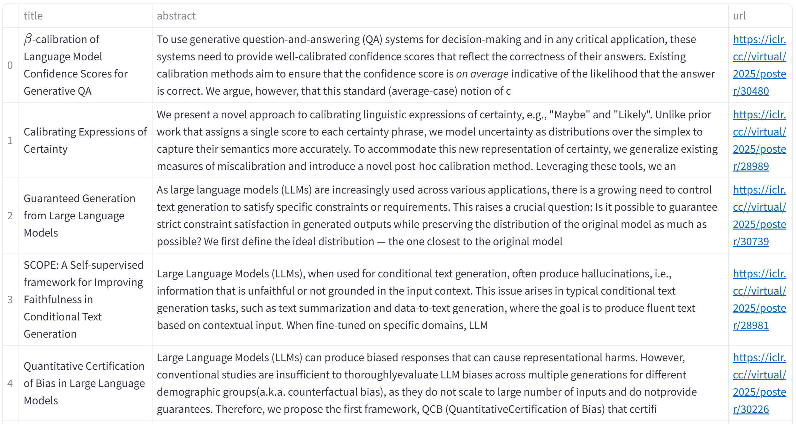

# ᯤpaper-sonar

[README_ja](./README_ja.md)

- A code that suggests papers similar to input keywords

## Target

- Accepted papers from ICLR2025

> [!NOTE]
> This can be repurposed for any conference where paper titles, abstracts, and URLs are available by simply replacing the target files

## Process

- Concatenate title, first 600 characters of abstract, and URL in plain text
- Convert to vectorstore using embedding model
- Output best-n similar papers using approximate nearest neighbor search


> [!NOTE]
> The embedding model was selected based on [MTEB leaderboard](https://huggingface.co/spaces/mteb/leaderboard)

## Implementation

1. Download accepted papers from this link
  - Place in `data` directory

2. Convert to txt file

```python
python src/build_db/json2txt.py
```

3. Convert to vectorstore

```python
python src/build_db
```

## HuggingFace demo

1. Create a new space on Huggingface account
2. Move the following files to the created space:
- `app.py`
- vectorstore files created in `data/db` folder
- `requirements.txt`


## Case Study

`query`: β-calibration of Language Model Confidence Scores for Generative QA
`suggestion`:


